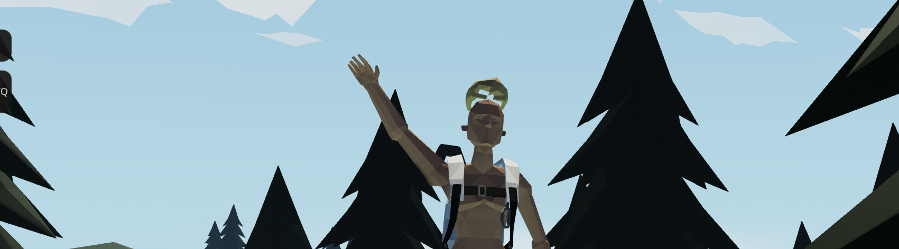

# cuhHub

## 📚 | Information
cuhHub is a community centered around the game Stormworks: Build and Rescue. We host numerous multiplayer servers that differ largely from other servers for players to join and play around on. Everything from the backend, all the way to the frontend, is made by us.

## 📥 | Joining Our Servers
To join our Stormworks servers, simply load up the game and search "cuhHub" in the in-game server browser. From there, choose one of our servers and click the join button.

We recommend you join our [Discord](https://dsc.gg/cuhhubsw) to stay up-to-date with announcements, server updates, and such.

## 💻 | Developers
- **[Cuh4](https://github.com/Cuh4)** | Owner, Main Developer
- **[PirateJake2000](https://github.com/PirateJake2000)** | Developer
- **[technyk](https://github.com/technyk)** | Contributor

---

